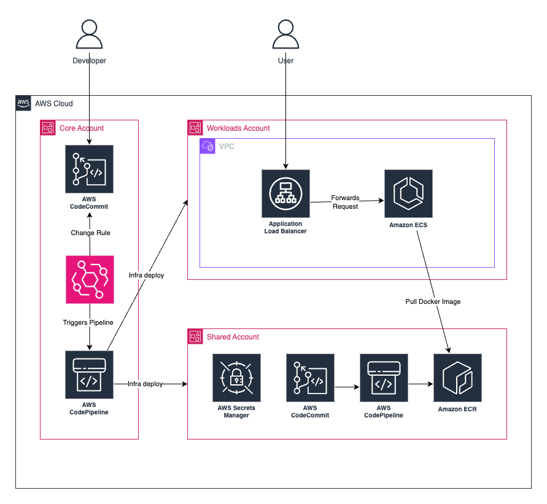
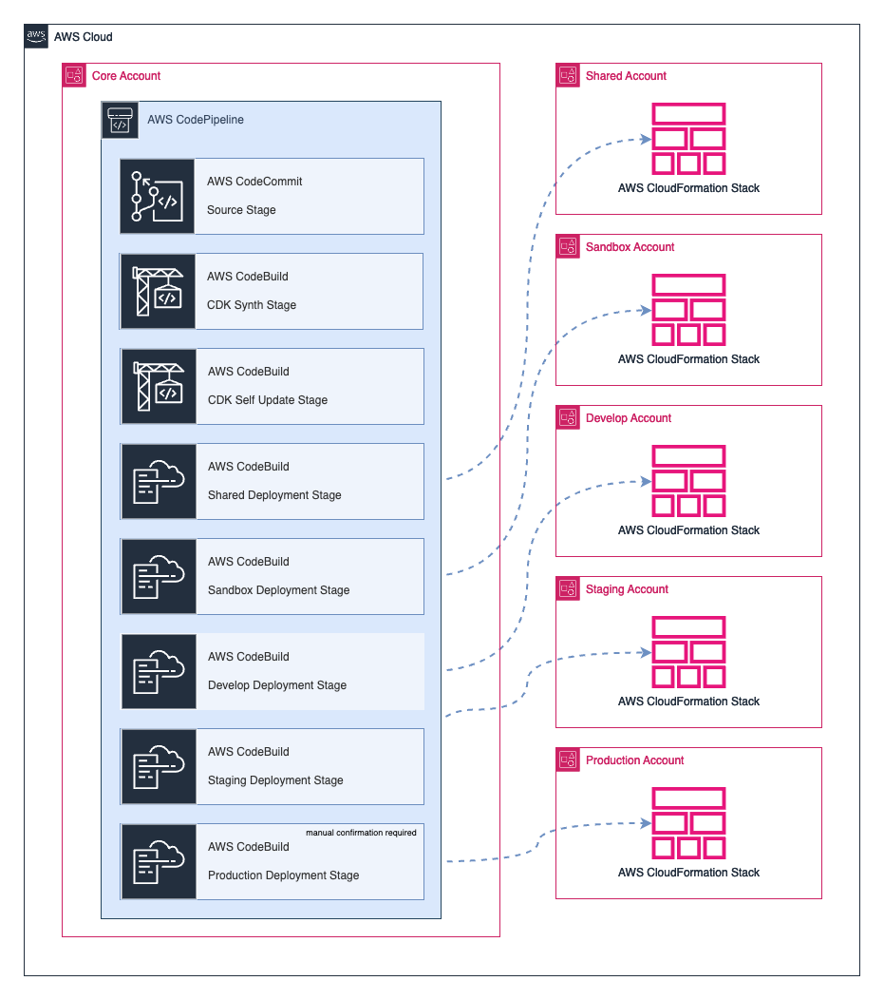

# AWS CodePipeline Gitflow Demo

The project demonstrates how to implement a CI/CD pipeline using AWS CodePipeline and AWS CDK. The project uses the Gitflow branching model to manage services that are deployed across multiple AWS accounts for different environments.

## Table of Contents

1. [Solution Overview](#solution-overview)
2. [Components](#components)
    * [Infrastructure](#infrastructure)
    * [Demo Service](#demo-service)
3. [Prerequisites](#prerequisites)
4. [Getting Started](#getting-started)
    * [Configure the AWS CLI](#configure-the-aws-cli)
    * [Installation](#installation)
    * [Setup accounts](#setup-accounts)
    * [Bootstrap the CDK Toolkit on accounts](#bootstrap-the-cdk-toolkit-on-accounts)
    * [Deploying the infrastructure](#deploying-the-infrastructure)
    * [Setup and deploy demo service](#setup-and-deploy-demo-service)
5. [Cleanup](#cleanup)

## Solution Overview

Architecture Landscape


Infrastructure Pipeline


Gitflow Development Workflow for Services


## Components

The following main components are part of the project:

* Core
  * Infrastructure CodePipeline
* Shared resources
  * ECR repositories for Docker images build for services
  * CodeCommit repositories for services code
  * Services CI/CD pipelines
  * Secrets Manager
* Workloads environments
  * Network baseline resources
  * Application Load Balancer
  * ECS cluster

### Infrastructure

The infrastructure code is written in TypeScript using the AWS Cloud Development Kit (CDK).

### Demo Service

The demo service is a simple Node.js application that displays a static web page.

See the [demo service repository](https://github.com/grigore147/aws-codepipeline-gitflow-service-demo) for more details.

## Prerequisites

* Prepared AWS accounts.
* Some knowledge about the following topics:
  * AWS CDK
  * AWS CloudFormation
  * AWS CodePipeline
  * IAM roles and policies for cross-account access
  * TypeScript
* Tech Stack / Tools:
  * [Node.js](https://nodejs.org/en/)
  * [AWS CLI](https://docs.aws.amazon.com/cli/latest/userguide/cli-chap-welcome.html)
  * [AWS CDK on TypeScript](https://docs.aws.amazon.com/cdk/latest/guide/home.html)
  * [Taskfile](https://taskfile.dev/#/)
  * [git-remote-codecommit](https://docs.aws.amazon.com/codecommit/latest/userguide/setting-up-git-remote-codecommit.html)

### AWS accounts structure

There are different ways to create and structure AWS accounts based on the organization needs.

[AWS Organizations](https://docs.aws.amazon.com/organizations/latest/userguide/orgs_introduction.html) is a service that enables you to consolidate multiple AWS accounts into an organization that you create and centrally manage. Organizations includes account management and consolidated billing capabilities that enable you to better meet the budgetary, security, and compliance needs of your business.

This project assumes that the following accounts structure can be provided for the infrastructure deployment that will follow the Gitflow branching model:

* `core`: Account with Core CodePipeline that deploys the infrastructure across multiple aws accounts for all required environments.

  * Code repository for the infrastructure code in CodeCommit.
  * Core CI/CD pipeline as CodePipeline.

* `shared`: Account with shared resources that are used by workloads environments.

  * ECR repositories for the Docker images build for workloads services.
  * CodeCommit repositories for the services code.
  * Services CI/CD pipelines as CodePipeline for the services Gitflow branches.
  * Miscellaneous shared or local resources used for different needs.

* `sandbox`: Account for sandbox environment with ephemeral deployments where developers can test their changes in feature branches.

  * Workloads network baseline resources like VPC, subnets, security groups, etc.
  * Application Load Balancer for handling the traffic to the ECS services.
  * ECS cluster for the workloads services.

* `develop`: Develop environment where developers can test their changes in develop branch for integration testing.
* `staging`: Staging environment where the QA team can test the release branch.
* `production`: Environment where the production-ready changes are deployed from the main branch.

> [!NOTE]
> In the `sandbox` account, multiple versions of the same service can be deployed for each feature branch created, but in the same ECS cluster.

> [!NOTE]
> The `sandbox`, `develop`, `staging` and `production` accounts will get the same set of resources. However, the resources size and configuration can be different based on the environment needs.

See [getting started guide](https://docs.aws.amazon.com/cdk/v2/guide/getting_started.html) on how to create and manage AWS accounts.

> [!IMPORTANT]
> It is required that the `core` account to have the necessary permissions to deploy the infrastructure in the other accounts by assuming a role in the target account.

### Tech Stack

* [AWS CLI](https://docs.aws.amazon.com/cli/latest/userguide/getting-started-install.html).

* [Node.js](https://nodejs.org/en/download/) ~v20.14 ([nvm](https://github.com/nvm-sh/nvm?tab=readme-ov-file#installing-and-updating))

## Getting Started

### Configure the AWS CLI

Before deploying the infrastructure, you need to configure the AWS CLI with the necessary credentials and region for the `core` account.

```bash
# Configure the AWS CLI with the profile for the core account (long-term credentials)
aws configure --profile demo-core

# or

# Configure and authenticate the core account with the AWS SSO
aws configure sso --profile demo-core
aws sso login --profile demo-core
```

### Installation

```bash
# Clone the repository
git clone https://github.com/grigore147/aws-codepipeline-gitflow-demo.git

# Change the directory
cd aws-codepipeline-gitflow-demo/infrastructure

# Install the dependencies
npm ci
```

### Setup accounts

Before deploying the infrastructure, we need to provide the accounts information that will be used in the project.

Run interactive setup that will store the accounts information in the `accounts.json` file

```bash
task accounts:setup
```

### Bootstrap the CDK Toolkit on accounts

Deploy the CDK Toolkit Stack on all accounts.

```bash
task accounts:bootstrap
```

### Deploying the infrastructure

Before deploying the infrastructure, may be needed to provide the Docker Hub credentials that will be used to pull the Docker images from the public registry to avoid getting the "too many requests" error in the CodeBuild.

We can use the following command to provide the Docker Hub credentials, which will be stored in the SecretsManager in the `shared` account and used later in CodeBuild to authenticate with the Docker Hub:

```bash
# Provide the Docker Hub username and password in interactive mode
task infra:set-docker-credentials
```

Deploy the application infrastructure with following command:

```bash
task infra:deploy
```

This command will deploy the infrastructure in the `core` account and will create the CodePipeline that will deploy the full infrastructure for our application.

However, the pipeline will fail at the first time, since it is intended to be run when we commit changes in the infrastructure code repository.

To do this, let's commit the changes that have accounts setup in the infrastructure code repository and push to the created CodeCommit repository in the `core` account.

> [!NOTE]
> Select and configure one of the available access methods to the infrastructure repository in the `core` account.

```bash
git add .

git commit -m "Project setup"

git push origin main
```

After the push, the pipeline will start and deploy the infrastructure in the all accounts.

### Setup and deploy demo service

To test this project, we have a `demo` service that will be built and deployed using Gitflow branching model.

The services are developed in their own repositories in the `shared` account.

See the [demo service repository](https://github.com/grigore147/aws-codepipeline-gitflow-demo-service) for more details.

Once we push the service code, the service pipeline will start and deploy the service in an environment related to git branch that was updated, on a URL like `http://<alb-dns>/<environment>/<service-name>` or `<service-name>.<environment>.<alb-dns>`, depending on which url type is set.

## Cleanup

To remove the infrastructure from the `sandbox`, `develop`, `staging` and `production` accounts, manually delete the CloudFormation stacks created by the CDK.

Stack name format: `${Environment}-WorkloadsStack`, example `Sandbox-WorkloadsStack`.

To remove the infrastructure from the `core` account, run the following command:

```bash
task infra:destroy
```

To remove the CDK Toolkit Stack from all accounts, run the following command:

```bash
task accounts:cleanup
```

## Related articles

* [Gitflow Workflow](https://www.atlassian.com/git/tutorials/comparing-workflows/gitflow-workflow)
* [Implement a Gitflow branching strategy for multi-account DevOps environments](https://docs.aws.amazon.com/prescriptive-guidance/latest/patterns/implement-a-gitflow-branching-strategy-for-multi-account-devops-environments.html)
* [AWS CDK Pipeline](https://aws-samples.github.io/aws-deployment-pipeline-reference-architecture/application-pipeline/ri-cdk-pipeline/)
* [Set up a CI/CD pipeline by using AWS CodePipeline and AWS CDK](https://docs.aws.amazon.com/prescriptive-guidance/latest/patterns/set-up-a-ci-cd-pipeline-by-using-aws-codepipeline-and-aws-cdk.html)
* [Implementing GitFlow Using AWS CodePipeline, AWS CodeCommit, AWS CodeBuild, and AWS CodeDeploy](https://aws.amazon.com/blogs/devops/implementing-gitflow-using-aws-codepipeline-aws-codecommit-aws-codebuild-and-aws-codedeploy/)
